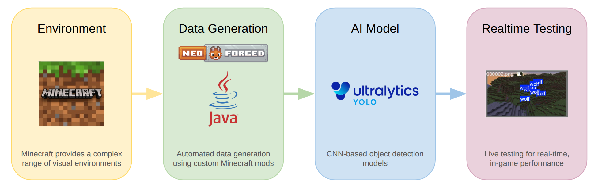

 

## Outline

Our project aims to build a real-time wolf detection system for Minecraft that locates wolves in a live gameplay environment. Using automatically generated in-game visual data and labeled 2D coordinates, the model learns to identify wolves from automatically generated screenshots. The result is a fast, gameplay-ready detector that gives players fast visual awareness of wolves in their world.

## Source Code

View the [Source Code](https://github.com/andrew-wang0/cs175-wolf-detector-main)

## Resources

Our project uses [NeoForged](https://neoforged.net/) for automated data generation in Minecraft. 
We also use [ultralytics](https://www.ultralytics.com/) YOLO models for object detection.